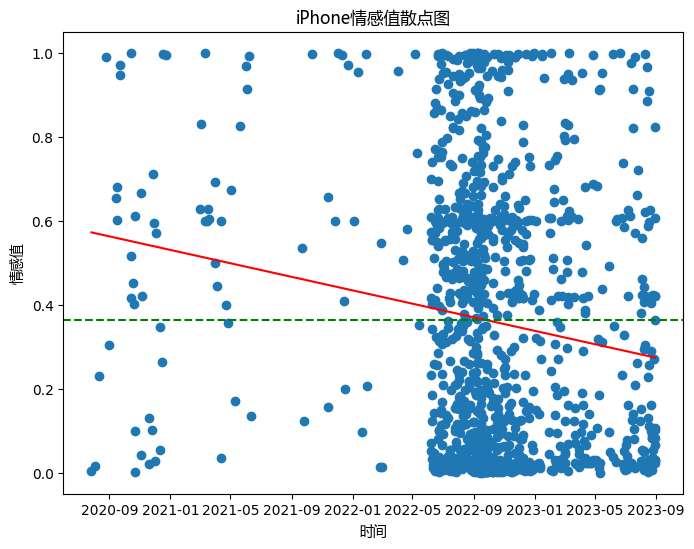
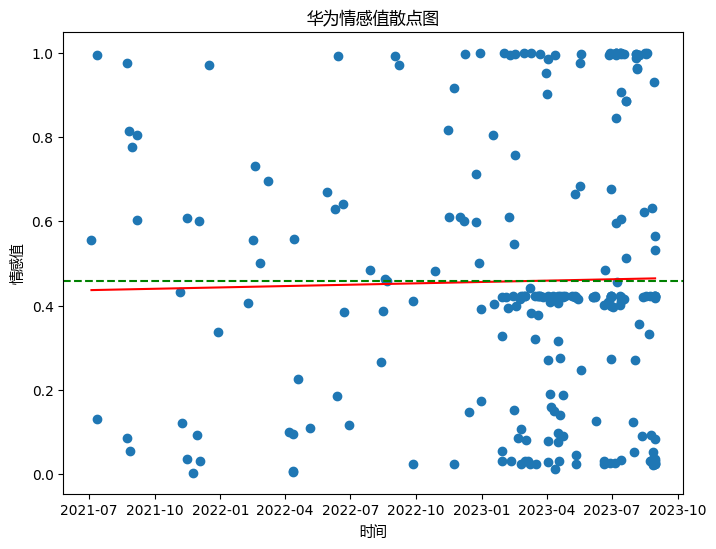
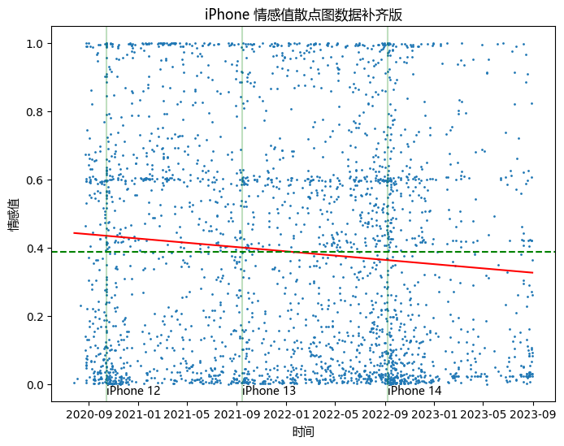
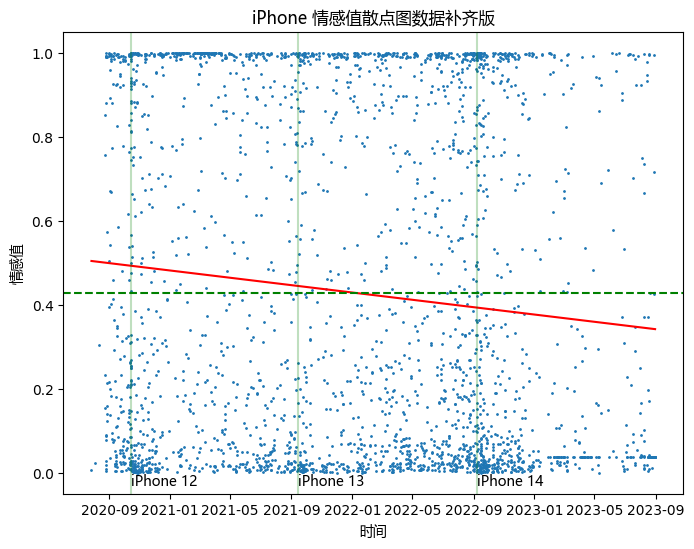
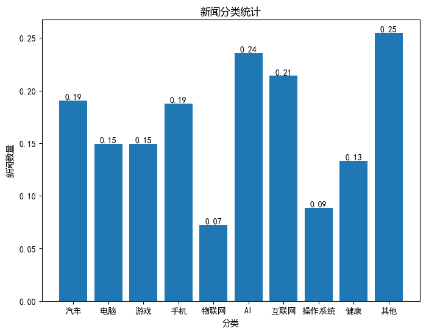

# 数据分析

## 词频分析

### 全部内容

首先我对所有新闻内容进行了分词, 并对词频进行了分析.

分词的 python 脚本位于 `./KeywordAnalyser.py`.

用 wordcloud 包建立了词云, 代码如下:

```python
from wordcloud import WordCloud
import sqlite3
import re
import matplotlib.pyplot as plt

PureSymbolRe = re.compile('')

tags = {}
conn = sqlite3.connect('newsInfo.db')
cursor = conn.execute("SELECT * FROM (SELECT word, SUM(count) AS cnt FROM words GROUP BY word)t ORDER BY cnt DESC")

for row in cursor:
    if len(row[0]) > 1:
        tags[row[0]] = row[1]

font_path = 'C:/Windows/Fonts/msyh.ttc'
wordcloud = WordCloud(font_path=font_path, width=1000, height=1000, max_words=100, background_color='white').generate_from_frequencies(tags)

plt.figure(figsize=(10, 10))
plt.imshow(wordcloud)
plt.axis("off")
plt.show()

```

得到的词云如下:


可以看出, **产品 / 市场 / 用户 / 公司 这些与商品的生产流通分不开的词汇是频率最高的词汇**; 由于我爬虫爬取的分区中有 "苹果" 分区, 故在所有的词汇中, "苹果" "iPhone" 出现的频率很高.

由于停用词列表有缺漏, "一个" 这一通用数量词没有被正确过滤, 出现频率很高.

### 近期内容

将时间拉近到近一个月, 用类似的方法我们得到了另一张词云:


由于8月是公司二季报和半年报发布的时间, 8月的**科技新闻很多与科技公司的上半年营收和行业前景展望相关**; 同时可以看出, **新浪将与科技企业的相关的财经新闻归类为科技新闻**.

## 文章情感分析

使用 cemotion 库进行了对部分主题文章的情感分析.

由于爬取的数据包含较多苹果区的文本, 我对以 iPhone 为标题的文章进行了情感分析:

```python
from cemotion import Cemotion
import sqlite3
import pandas as pd
import re

ImagePlaceholderRe = re.compile(r'<_IMAGE_\d+_.*?_/>')

c = Cemotion()

dbconn = sqlite3.connect('newsInfo.db')
news = pd.DataFrame(
    dbconn.execute('SELECT news.title, contents.content, news.created_at FROM news LEFT JOIN contents ON news.docid = contents.docid WHERE title LIKE "%%iPhone%%" ORDER BY created_at ASC').fetchall(),
    columns=['title', 'content', 'created_at'],
).dropna()
news['created_at'] = pd.to_datetime(news['created_at'], unit='s')

def ParseNewsContent(content: str) -> list[str]:
    # Remove image placeholders
    ImagePlaceholderRe.sub('', content)

    # The first line is always ads or author or sth unimportant
    content = content.splitlines()[1:]

    # Strip all lines and remove lines too short
    for i in range(len(content)):
        content[i] = content[i].strip()
    
    content = list(filter(lambda x: len(x) > 5, content))
    return content

news['content'] = news['content'].apply(ParseNewsContent)

def GetPrediction(data) -> float:
    title_emotion = c.predict(data['title'])
    content_emotion = c.predict(' '.join(data['content']))
    print(f'Parsed {data["title"]}: {title_emotion} {content_emotion}')
    return title_emotion * 0.4 + content_emotion * 0.6


news['emotion'] = news.apply(GetPrediction, axis=1)

import matplotlib.pyplot as plt
import numpy as np
from sklearn.linear_model import LinearRegression

font = {'fontname': 'Microsoft YaHei'}

timestamp = np.array(news['created_at'].apply(lambda x: x.timestamp())).reshape(-1, 1)
model = LinearRegression().fit(X=timestamp, y=np.array(news['emotion']).reshape(-1, 1))

image = plt.figure(figsize=(8, 6))
plt.scatter(news['created_at'], news['emotion'])
plt.plot(news['created_at'], model.predict(timestamp), color='r')
plt.xlabel('时间', font)
plt.ylabel('情感值', font)
plt.title('iPhone情感值散点图', font)
plt.axhline(y=np.average(news['emotion']), color='g', linestyle='--')
plt.show()

```

得到散点图如下:



从散点图的数据集中性来看, 2022年9月的苹果发布会前后是对iPhone报道最集中的时间. 对每篇文章以标题0.4, 内容0.6的权重得到情感分数后, 从趋势线可以看出苹果在内地的口碑有下滑的趋势, 且平均值较低.

作为对比 (夹带私货), 我把关键词换成华为以同样的方式得到了一幅图:



可以看到, 新浪科技对华为的评价整体好于苹果, 且评价呈现微小的上升趋势.

但由于在 iPhone 评价图中 2022 年 7 月后的数据比之前要显著密集, 我检查了爬取的数据集, 发现 2022 年 7 月后的是从 "苹果汇" 子栏目按照页数爬取的, 该 API 到 2022 年 7 月时失效, 不再返回更早的内容. 因此, 我重新定位了按照结束时间排序的 "iPhone" 子区的 API `https://feed.sina.com.cn/api/roll/get?pageid=217&lid=1810&num=50&versionNumber=1.2.4&ctime={starttime}&encode=utf-8` 进行了爬取, 将爬取的时间拓展到 2020 年 9 月. 

数据处理的过程类似, 绘图部分的代码如下:

```python
import matplotlib.pyplot as plt
import numpy as np
from sklearn.linear_model import LinearRegression
import datetime

font = {'fontname': 'Microsoft YaHei'}

timestamp = np.array(news['created_at'].apply(lambda x: x.timestamp())).reshape(-1, 1)
model = LinearRegression().fit(X=timestamp, y=np.array(news['emotion']).reshape(-1, 1))

image = plt.figure(figsize=(8, 6))
plt.scatter(news['created_at'], news['emotion'], s=1)
plt.plot(news['created_at'], model.predict(timestamp), color='r')
plt.xlabel('时间', font)
plt.ylabel('情感值', font)
plt.title('iPhone 情感值散点图数据补齐版', font)
plt.axhline(y=np.average(news['emotion']), color='g', linestyle='--')
plt.axvline(x=datetime.datetime(2020, 10, 14, 0, 0, 0), color='#00800040', linestyle='-')
plt.text(datetime.datetime(2020, 10, 14, 0, 0, 0), -0.03, 'iPhone 12', font)
plt.axvline(x=datetime.datetime(2021, 9, 14, 0, 0, 0), color='#00800040', linestyle='-')
plt.text(datetime.datetime(2021, 9, 14, 0, 0, 0), -0.03, 'iPhone 13', font)
plt.axvline(x=datetime.datetime(2022, 9, 8, 0, 0, 0), color='#00800040', linestyle='-')
plt.text(datetime.datetime(2022, 9, 8, 0, 0, 0), -0.03, 'iPhone 14', font)
plt.show()

```

得到的新散点图如下:



我将苹果三年发布会的时间以竖线的形式叠加在了图表上. 可以清楚观察到, **每到发布会前夕, 与 iPhone 有关的新闻数量增加, 毁誉参半**. 这与科技区追求新兴科技, 追求拿到 "首发评测" 等来获得流量是吻合的. 同时可以看到, 近期 iPhone 有关的内容又多了起来, 我预期这与即将于 2023 年 9 月 13 日到来的 iPhone 15 发布会有密切关系.

但是, 尽管补全了数据, 对 iPhone 的评价倾向 (线性回归) 依然是负面 (b < 0) 的.

此外, 我们注意到在 `y=0.6` 处有一条数据点较为密集的区域. 通过分析代码执行的中间结果, 这是由于 `cemotion` 库将部分中立的标题错误判断为负面而内容判断为正面, 经过赋权导致的. 因此, 我将标题的权重去除, 得到了另一幅散点图:



图示包含的信息与上一张图无异, 不再过多赘述.

## 关注程度

我们对 **2023 年以来** 新浪科技对包括 汽车 (燃油车, 电动车等), 电脑 (笔记本, 台式机组件等), 手机, 物联网设备, 人工智能 等类型的关注度 (涉及到的文章占所有文章占比) 进行了统计:

```python
import sqlite3
import matplotlib.pyplot as plt
import numpy as np

StartTimestamp = 1672531200

dbconn = sqlite3.connect('newsInfo.db')

news = dbconn.execute(f'SELECT news.docid, news.title, news.created_at FROM news LEFT JOIN contents ON news.docid = contents.docid WHERE news.created_at >= {StartTimestamp} ORDER BY created_at ASC').fetchall()

car_keyword = ["汽车", "燃油车", "电动车", "电动汽车", "燃油"]
pc_keyword = ["CPU", "笔记本", "电脑", "主机", "显卡", "GPU"]
game_keyword = ["游戏", "游戏机", "游戏主机"]
mobile_keyword = ["手机", "平板"]
web_keyword = ["网站", "网页", "互联网", "TCP", "UDP", "运营商", "路由器", "交换机"]
iot_keyword = ["物联网", "智能家居", "智能穿戴", "XR", "AR", "VR", "智能手表", "Watch", "扫地机器人"]
ai_keyword = ["AI", "大模型", "人工智能"]
os_keyword = ["操作系统", "Windows", "Linux", "MacOS", "iOS", "Android", "HarmonyOS", "OS"]
health_keyword = ["医疗", "健康", "疫苗", "医学"]

def GetCat(cat: list[str]):
    cat = ','.join(f'"{x}"' for x in cat)
    # print(f'SELECT news.docid FROM words LEFT JOIN news ON news.docid = words.docid WHERE word IN ({cat}) AND news.created_at >= {StartTimestamp} GROUP BY news.docid')
    return set(i[0] for i in dbconn.execute(f'SELECT news.docid FROM words LEFT JOIN news ON news.docid = words.docid WHERE word IN ({cat}) AND news.created_at >= {StartTimestamp} GROUP BY news.docid'))

car_cat = GetCat(car_keyword)
pc_cat = GetCat(pc_keyword)
game_cat = GetCat(game_keyword)
mobile_cat = GetCat(mobile_keyword)
web_cat = GetCat(web_keyword)
iot_cat = GetCat(iot_keyword)
ai_cat = GetCat(ai_keyword)
os_cat = GetCat(os_keyword)
health_cat = GetCat(health_keyword)
other_cat = set(n[0] for n in news) - car_cat - pc_cat - mobile_cat - game_cat - iot_cat - ai_cat - web_cat - health_cat - os_cat

cat_names = ['汽车', '电脑', '游戏', '手机', '物联网', 'AI', '互联网', '操作系统', '健康', '其他']
cat_data = np.array([len(car_cat), len(pc_cat), len(game_cat), len(mobile_cat), len(iot_cat), len(ai_cat), len(web_cat), len(os_cat), len(health_cat), len(other_cat)]) / len(news)

import matplotlib

matplotlib.rcParams['font.family'] = 'SimHei'
graph = plt.figure(figsize=(8, 6))
plt.bar(cat_names, cat_data)
plt.xlabel('分类', font)
plt.ylabel('新闻数量', font)
plt.title('新闻分类统计', font)
plt.show()

```

由于文章与类型是多对多的关系, 故我使用了条形图进行展现:



可以看到, **AI 确实是当今科技圈最关注的对象**. 在爬取的 2023 年以来的新闻中, 提及 AI 的占比在 24% 左右. **互联网也是科技圈关注的重点, 主要原因可能是其涉及面广泛**. 新能源车由于其方兴未艾, 加上近期辅助驾驶 / 自动驾驶技术在人工智能等新技术的助力下蓬勃发展, 成为了与手机平起平坐的关注重点.

由于个人分类水平有限, 同时也因为科技新闻的种类繁多, 互相交叉, 且网上无能够通过文章内容准确分辨文章主题的模型, 在短期内我也无法自行构建模型, 这些类别很可能无法包含全部内容, 且有的分类较广, 有的则较窄. 但总体上得到的结果是可以解释的, 符合情理的.