# README

这是 THU CS 暑期学期 Python 新闻客户端的一个粗糙的实现. 以下为文档

# 实验报告 & 开发文档

<span style="float: right;"> By: Ajax </span>

## 爬虫部分

本次爬虫与数据分析实验的耗时很长, 发现的 Bug 和后期更改数据库结构较多, 我无法保证源码的完全一致性 (如部分后期加入的数据表列可能没有同步到创建表命令中), 望老师助教海涵.

### 选择目标

在选取爬取的目标时, 我翻找了:

- 网易科技, 其主页向下滚动仅3页, 到底后 "查看所有" 链接 (http://tech.163.com/gd/) 无法打开.

- 腾讯科技, 一次接口请求如下, 仅返回10条数据, 且接口无法控制获取的内容的时间, 是否会有重复或总量限制不得而知. (但是确实能爬)
```javascript
fetch("https://r.inews.qq.com/web_feed/getPCList", {
  "headers": {
    "accept": "*/*",
    "accept-language": "en-US,en;q=0.9,zh-CN;q=0.8,zh;q=0.7,en-GB;q=0.6,zh-TW;q=0.5",
    "content-type": "application/json",
    "sec-ch-ua": "\"Chromium\";v=\"116\", \"Not)A;Brand\";v=\"24\", \"Microsoft Edge\";v=\"116\"",
    "sec-ch-ua-mobile": "?0",
    "sec-ch-ua-platform": "\"Windows\"",
    "sec-fetch-dest": "empty",
    "sec-fetch-mode": "cors",
    "sec-fetch-site": "same-site"
  },
  "referrer": "https://new.qq.com/",
  "referrerPolicy": "strict-origin-when-cross-origin",
  "body": "{\"qimei36\":\"\",\"forward\":\"1\",\"base_req\":{\"from\":\"pc\"},\"flush_num\":null,\"channel_id\":\"news_news_tech\",\"device_id\":\"\",\"is_local_chlid\":\"\"}",
  "method": "POST",
  "mode": "cors",
  "credentials": "omit"
});
```

- CCTV 科技, 主页信息在 300 条以内

- 新华网科技, 滚动信息直接由一个 json 文件获取, 有 1000 条, 但是也只有 1000 条...

- 新浪科技, "滚动新闻" 里面一页有 30 条, 底部显示有 2558 页, 使用 json 格式的接口获取, 看上去很不错.

### 爬取新闻列表

于是我独立地将目标锁定在 **新浪科技**, 编写了第一版 `NewsListAPI.py` 对滚动新闻进行了按页爬取. 此处有一个技巧: 请求的网址 (编写此文档时抓取) 为 `https://feed.mix.sina.com.cn/api/roll/get?pageid=372&lid=2431&k=&num=50&page=1&r=0.155101697930629&callback=jQuery111208731721195168252_1693538681216&_=1693538681218`, 得到的是 JSON Callback 格式的返回. 观察到 API 中有 `callback=jQuery111208731721195168252_1693538681216`, 将其删掉后返回的就是可解析的json. 简化后的 API 为 `https://feed.mix.sina.com.cn/api/roll/get?pageid=372&lid=2431&k=&num=50&page={page}`.

然而, 爬取了约 100 页后, 这个 API 就不返回数据了 (原因未知), 因此我又把科技区的几个子类 (创事记等) 的 API 分别爬取, **数据量达到了 12000 条**. 爬取的命令为 `python Scraper/NewsListAPI.py`. 我把得到的数据的关键信息提取出来存到 `newsInfo.db` 中.

### 爬取新闻内容

通过分析爬取到的新闻 URL 可以发现新浪新闻的正文分属多个服务器下, 包括但不限于 `tech.sina.com.cn`, `finance.sina.com.cn`, `zhongce.sina.com.cn`, `silde.tech.sina.com.cn`, `city.sina.com.cn`, `cj.sina.com.cn`, `k.sina.com.cn`. 由于每一个服务器的新闻都有自己的模板, 需要分别爬取, 我放弃了 slide, city, cj, k 这 4 个子域下的新闻 (主要原因是量太少, 并且主题与科技没啥关系), 为前三个分别编写了爬取逻辑, 于 `Scraper/NewsContents.py`.

我爬取新闻的思路是首先确认有没有能够直接拿到格式化内容的接口, 如果没有就用 bs4 解析 HTML, 找到正文所在的 div, 首先替换所有的图片 (``) 为放在 `<p>` 里面的自定义 placeholder (我的为 `<_IMAGE_{id}_{ORIGINAL_URL}_/>`), 然后用 bs4 的 `.text` 属性忽略所有的格式等, 每个 `<p>` 里面的内容为一行, 存入数据库; 同时下载前述图片于 `images/crawled/{document_id}_{id}.{extension}`. 此时通过 placeholder 即可构建图片标签.

### 爬取新闻评论

由于有按热度排序的要求, 我查找了各个模板的新闻对应的评论请求接口, 编写了 `Scraper/NewsComments.py`.

新浪科技的评论功能支持回复其他人的评论, 但是由于回复功能我们未做要求, 实现起来也相当麻烦 (主要是部分评论的回复量太大, 超过 2000 条, 必须折叠; 且回复的继承关系较为复杂), 我没有特意爬取评论的回复.

在实际操作中, 我发现新闻评论接口常常返回空数据 (错误数据), 故抓取错误返回的特征 (存在空列表 `toplist`), 构建了错误重试机制, 获得了正确的数据.

### 后续更改

在数据分析时, 我发现了部分数据缺失, 故修改部分代码补全了数据. 这部分新闻的图片没有爬取, 故没有同步到 Server 中. 使用 `SELECT count(*) FROM news` 得到的新闻摘要量为 `15288`; 使用 `SELECT count(*) FROM contents` 得到的新闻内容量为 `15184`; Server 中包含的新闻量为 12509.

### 特性

- 使用了 sqlite 数据库, 有效避免了在本地存放大量小文件, 访问高效

- 虽然编写了 3 个脚本文件, 但是由于对 sqlite 数据库的访问是互不干扰的, 故通过简单的修改, 这三个文件可以同时执行.

## 网站部分

我使用了 Material Design 的 js 和 css 构建网站风格, 创建了包含可收起的导航栏的主站. 在此首先直接介绍特性:

- 包含 12509 条新闻和 13907 条评论
- 使用 MD 风格, 自适应浏览器黑色模式
- 使用 django template 的继承功能, 实现了网页导航栏等部分代码的复用
- 使用 django template 的模块功能, 实现了新闻卡片 / 搜索卡片的复用
- 复用了新闻列表页以显示分类列表和搜索结果
- 充分优化数据库, 适当建立索引, 优化搜索体验
- 使用数据库检索 / 倒排索引双方法高速搜索
- 将数据分析文档集成到网站中

### 网站框架

网站后端使用 Django 框架, 各页面对应的网址如下:

```python
urlpatterns = [
  # 主页
  path('', views.Index, name='default'),
  path('Index', views.Index, name='index'),

  # 搜索页
  path('Search', views.Search, name='search'),

  # 用于建立搜索索引
  # path('Search/Init', views.InitSearchDb, name='initSearch'),

  # 用于从爬虫数据库导入文章
  # path('Import', views.ImportNewsData, name='import'),

  # 新闻详情页
  path('View/<str:document_id>', views.ViewNews, name='view'),

  # 评论添加 / 删除接口
  path('Comment', views.Comment, name='comment'),

  # 用于清空评论
  # path('Comment/Clear', views.ClearComment, name='clearComment'),

  # 用于从爬虫数据库导入评论
  # path('Comment/Import', views.ImportComment, name='importComment'),

  # 用于导入评论后全局更新评论数
  # path("Comment/Update", views.UpdateCommentCount,name="updateCommentCount"),

  # 新闻列表页, 分类列表页和搜索结果页
  path('List', views.ListNews, name='list'),

  # 分类页
  path('Categories', views.Categories, name='categories'),

  # 用于导入分类
  # path('Categories/Import', views.ImportNewsCategories,name='importCategories'),

  # 数据分析文档页
  path('Analysis', views.Analysis, name='analysis'),

  # 实验报告文档页
  path('Document', views.Document, name='document'),
]
```

我使用 Django 的 template 功能复用了网页导航栏, 搜索卡片, 新闻卡片等部分代码, 使得网站的风格统一, 且代码量较少.

网站前端使用了 Material Design 的 UI 库和 jQuery 的 js 库. UI 库能够自适应浏览器的窗口大小和深色模式, 使得网站在不同的设备上都能够有良好的显示效果. jQuery 库能够方便地操作与后端的 AJAX 请求, 省去不少麻烦.

### UI 模板 `base.html`

UI 模板是每一个页面共有的, 包含 js 和 css 的引入, 实现了导航栏, 可收缩的侧边栏, 并在正文位置留出用于继承的空白.

### 搜索卡片 `searchCard.html`

搜索卡片使用了 `mdui-card` 组件实现了卡片效果, 包含一个搜索框, 一个搜索按钮, 底部是分类选择, 结果排序选择和搜索模式选择.

分类选择可以通过按住 ctrl 选择多个分类, 也可以按住 shift 选择两个分类之间的所有分类.

结果排序方式包括按照时间 (降序) 排序和按照热度 (评论数量降序) 排序.

搜索模式包括精确搜索和关键词搜索. 精确搜索将搜索框中的内容作为一个整体进行搜索, 关键词搜索将搜索框中的内容按照空格分割为多个关键词, 搜索结果中包含所有关键词的新闻. 具体的搜索算法将在后面介绍.

### 新闻卡片 `newsCard.html`

新闻卡片同样实现了卡片效果, 包含了新闻的标题, 摘要, 作者, 时间, 评论数等信息.

### 首页 `index.html`

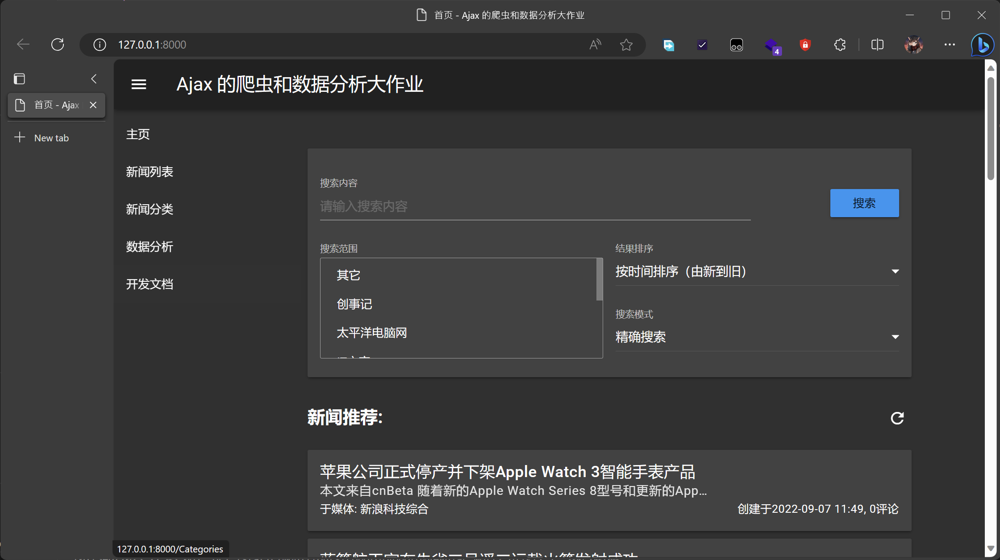

首页主要包含了搜索卡片, 以及随机的20条新闻列表. 刷新按钮使用 MDUI 的 `mdui-btn-icon` 样式和图标库中的 `refresh` 图标, 简洁美观.

### 新闻列表页 `listNews.html`

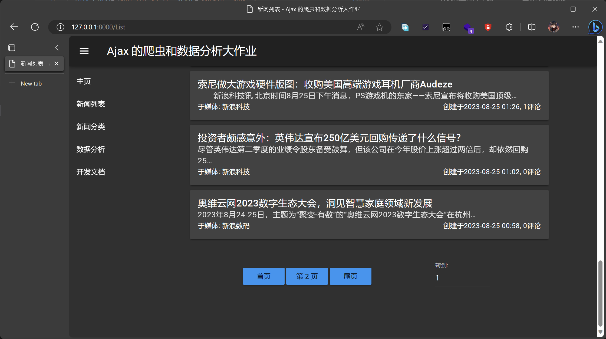

新闻列表页包含了默认为20张新闻卡片 / 页的列表和底部的分页器. 由于 MDUI 没有原生的分页器组件, 我使用了多个按钮和一个输入框实现了分页器的功能. 通过手动调整组件的 margin, 我尽量使得按钮与输入框在同一水平线上, 使得分页器的样式更加美观.

由于新闻列表页和分类列表页 / 搜索结果页的功能相似, 我使用了同一个模板, 通过传入不同的参数来实现不同的功能.

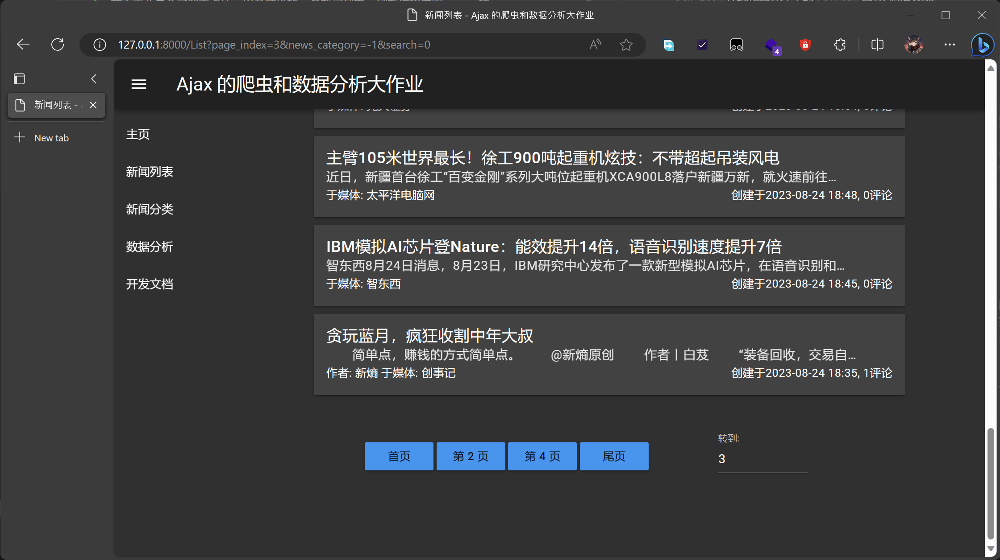

当用户不处在第一页时, GET 请求传入参数 `page_index={page}`, 标识当前页数, 服务器会返回对应页数的新闻列表.

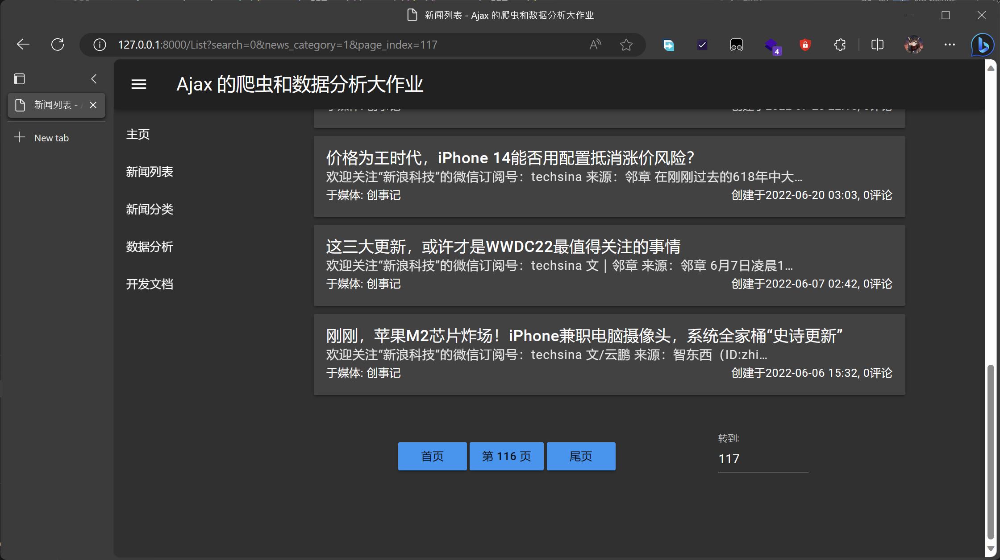

当用户从新闻分类页进入时, GET 请求传入参数 `news_category={category}`, 标识当前分类, 服务器会返回对应分类的新闻列表.


当用户提交搜索表单时, 搜索接口处理完成搜索放置于全局变量中 (若实现 session, 可以放置于 session 中) 并返回 302 重定向, GET 请求传入参数 `search=1`, 标识当前为搜索结果显示, 服务器会读取搜索结果并返回对应的新闻列表.

### 新闻详情页 `viewNews.html`

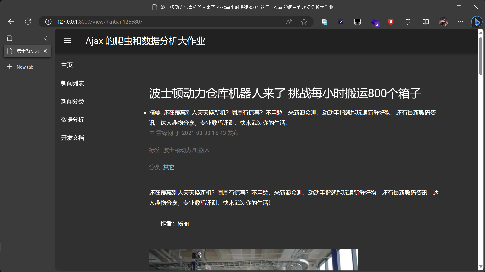

新闻详情页的开头是标题, 摘要, 发布者 (如有), 发布媒体 (如有), 发布时间, 标签 (如有) 和分类.

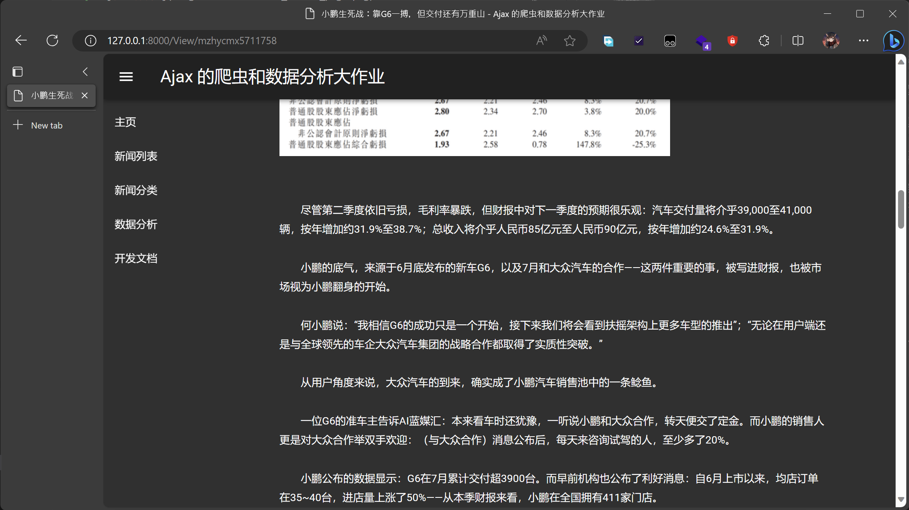

新闻详情页的正文使用了 MDUI 的 `mdui-typo` 样式, 使得正文的排版更加美观. 由于新闻的正文可能包含图片, 我使用了正则表达式匹配图片的占位符并将其替换为指向本地的图片标签, 使得图片能够在正文中显示. 同时, 我将正文的 `\n` 换行符替换为两个 `<br />` 标签, 使得正文的换行更加美观. 为防止正文与图片距离过近, 我在图片标签前后分别加入了 `<br />` 标签.

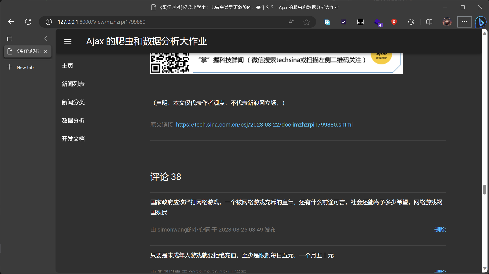

新闻的结尾我加入了原文超链接, 并以分割线 `<hr />` 与评论部分隔开.

每一条新闻的评论均由评论内容, 评论人, 评论时间和删除评论按钮组成. 值得一提的是, 点击删除评论将向 `/Comment` 接口发送 DELETE 请求, 服务器会删除对应的评论. 当删除评论后, 右上角将显示是否删除成功的提示. 若删除成功, 页面会在 1 秒后刷新.

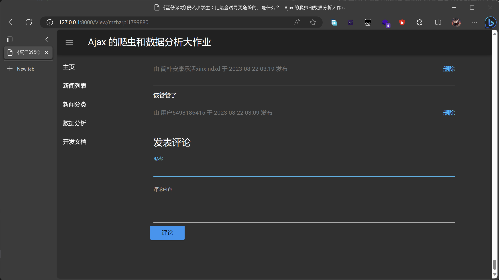

页面的最后是添加评论的表单, 包含评论人, 评论内容和提交按钮. 点击提交按钮将向 `/Comment` 接口发送 POST 请求, 服务器会添加对应的评论. 当添加评论后, 右上角将显示是否添加成功的提示. 若添加成功, 页面会在 1 秒后刷新.

### 分类页 `categories.html`

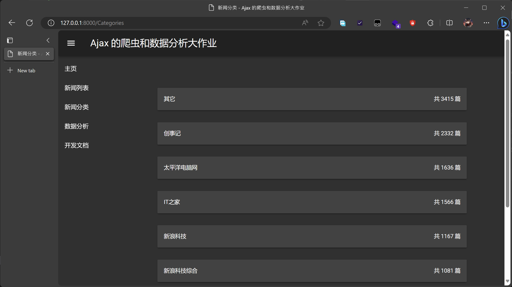

我按照新闻的来源进行了分类, 并将分类的名称和新闻的数量显示在了分类页中. 点击分类将向 `/List` 接口发送 GET 请求, 服务器会返回对应分类的新闻列表. 每个新闻来源的新闻质量有一定的差别, 新闻的关注点也不一样, 我认为这样的分类方式能够更好地帮助用户找到自己感兴趣的新闻.

### 搜索页 `search.html`

(写到这里, 我才发现由于搜索页的功能被主页完全覆盖了, 所以我的网站里并没有指向搜索页的入口... 所以我刚刚才去把搜索页加到侧边栏里去了, 后面的侧边栏和前面长得不太一样, 不要介意)

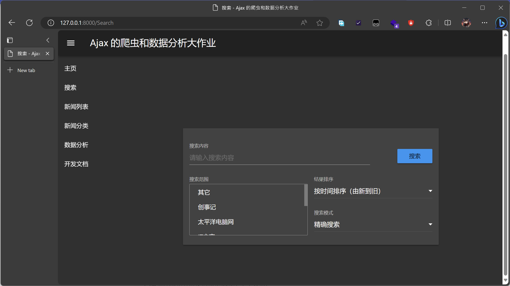

搜索页仅包含搜索卡片. 我将在此介绍搜索算法的实现.

**精确搜索** 的实现直接基于数据库. 借助数据库是原生 Library 的速度优势, 构造查询

```SQL
SELECT * FROM Blog_news WHERE category IN ({categories}) AND (title LIKE '%{keyword}%' OR content LIKE '%{keyword}%') ORDER BY {sort} DESC
```

将分类作为与的第一个条件快速排除掉不符合条件的新闻; 然后将新闻标题作为或的第一个条件, 将新闻内容作为或的第二个条件, 通过 LIKE 操作符快速筛选出符合条件的新闻; 最后按照排序方式排序. 该方法的优点是在声明了新闻类别后的检索速度非常快, 在检索空内容按评论数降序排序这一极端情况下, 搜索时间仍在 1ms 以内, 结果网页加载完毕的用时不超过 1s.

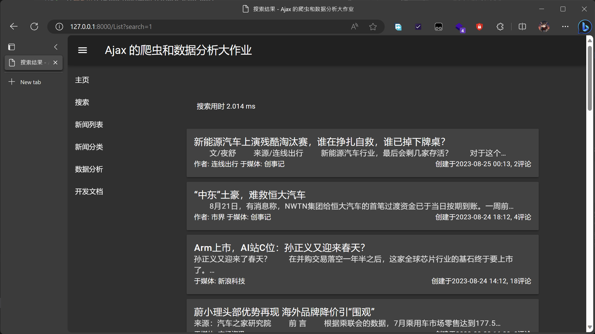

**关键词搜索** 的实现基于倒排索引. 我用 jieba 提取了新闻标题和新闻内容中的关键词, 并将关键词作为索引, 将新闻的 id 作为值, 构建了一个字典. 通过搜索框中的关键词, 我可以快速地找到包含该关键词的新闻的 id. 然后通过数据库查询对应 id 的新闻. 该方法的优点是能避免数据库的全表扫描; 缺点是第一次检索时需要首先从数据库中读取倒排索引到内存中并且要初始化 jieba 的分词库, 初始化时间在 5s 左右; 且如果输入没有关键词 (如空输入), 检索用时反而长于精确搜索.


### 数据分析页 `analysis.html`

这是数据分析 Markdown 的网页版, 在 VSCode 里面转换为 HTML 后直接复制粘贴过来的, 仅替换了图片的路径.

### 实验报告页 `document.html`

这里准备安放这篇文档的网页版.

## 收获与感想

### 时间分配

我感觉写网页爬虫大概用了 2 个小时吧, 但是爬虫在运行的过程中常常报错 (鬼知道新浪咋回事), 解决这些报错的时间算进去就得有 5 个小时了 (主要是因为 12000 篇文档和图片啥的实在是太多了, 我 sleep 了 1s 结果爬了有一整天, 中途笔记本还休眠了耽误了不少时间...). 对了, 后来爬评论又用了 3 个小时以上 (谁让评论 API 一直返回假数据...)

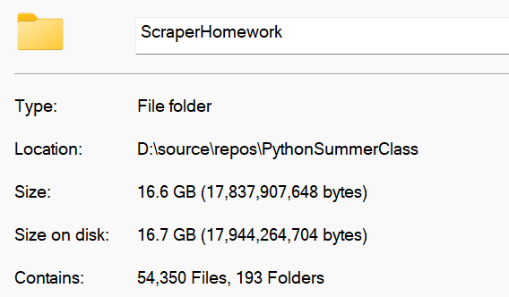

(上图不言而喻)

然后写网页的时间很长, 至少有 12 个小时. 大部分后端框架的逻辑都差不多, 我上学期写了 [电实验](https://github.com/84634E1A607A/RainDropWeb), 所以逻辑都懂, 但是排版啥的, 从一个 db 往另一个 db 搬数据啥的, 算法优化啥的, 数据库优化啥的都很耗时间.

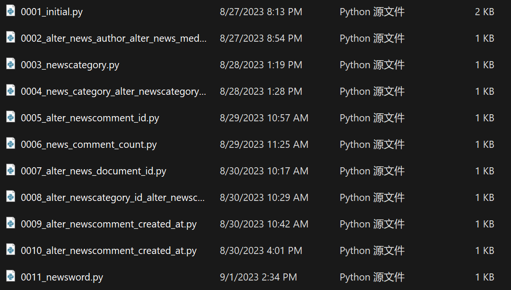

数据分析的时间应该在 3-5 个小时. 主要原因是我的电脑没有独立显卡, 跑模型只能拿 CPU 硬跑, 太慢了... 然后数据分析过程中发现了一些数据不足的问题, 又临时爬了 3000 多条数据下来.

写文档的时间也达到了 3-4 个小时, ~~真麻烦~~

### 收获

前后端的开发我之前都干过 (虽然是用的 ASP.Net), 爬虫之前也写过, 但是这次的开发过程中我学到了很多新的东西, 包括但不限于:

- Django 的用法, 尤其是 Model 的 ORM 用法
- 倒排算法的实现和优化
- 写文档 (嗯对)
- 数据库的自动化迁移
- 更深入了解数据库
- 发现了 Bootstrap, 下次试试